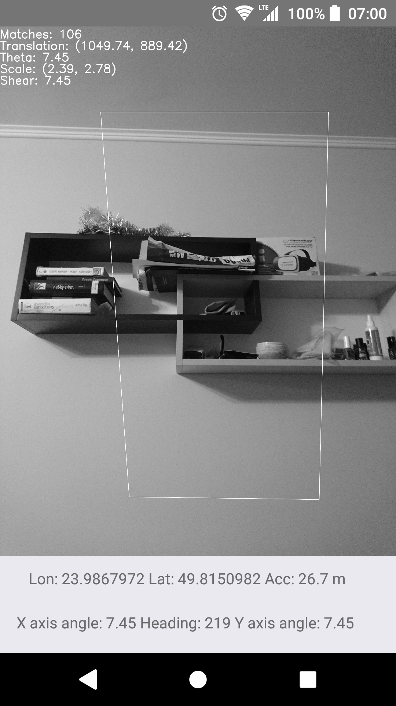

# Photoscan

Photoscan is an application that calculates angle and position differences between two photos, especially photos made in different centuries.

Goal of this application was to simplify photo collection using volunteers' mobile phones to obtain exact spot and location of historical photo.

Vision was to use this project to:
- preserve how cities looked in the past
- create VR tours into different centuries
- see how cities change in time

This project was made as part of CS Bachelor's diploma.

# Result from image recognition

# Historical photo, to which actual was compared

# Application architecture

Mobile application

Result screen

Tested only on Android!

Icons made by [monkik](https://www.flaticon.com/authors/monkik) from [www.flaticon.com](https://www.flaticon.com/") is licensed by  [Creative Commons BY 3.0](http://creativecommons.org/licenses/by/3.0)
